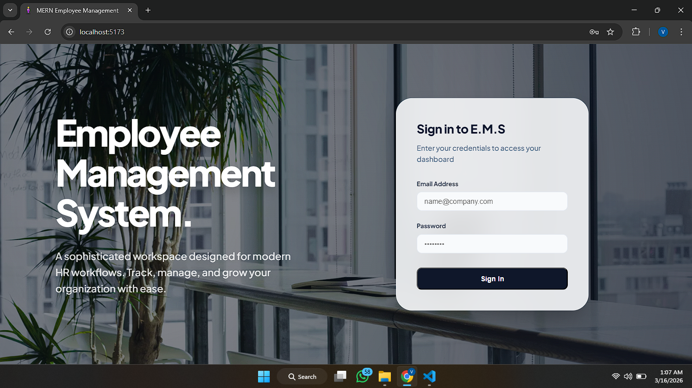
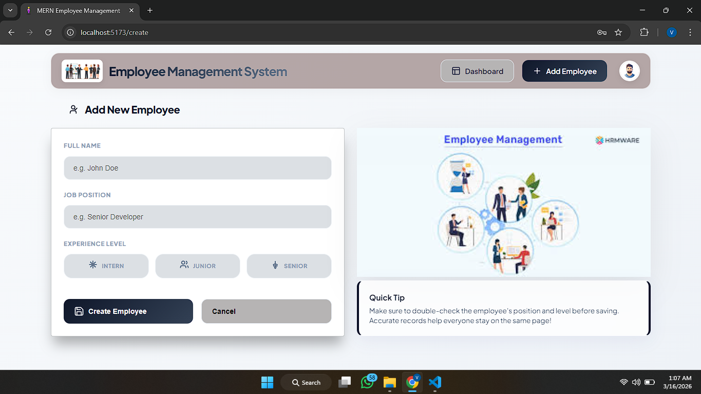
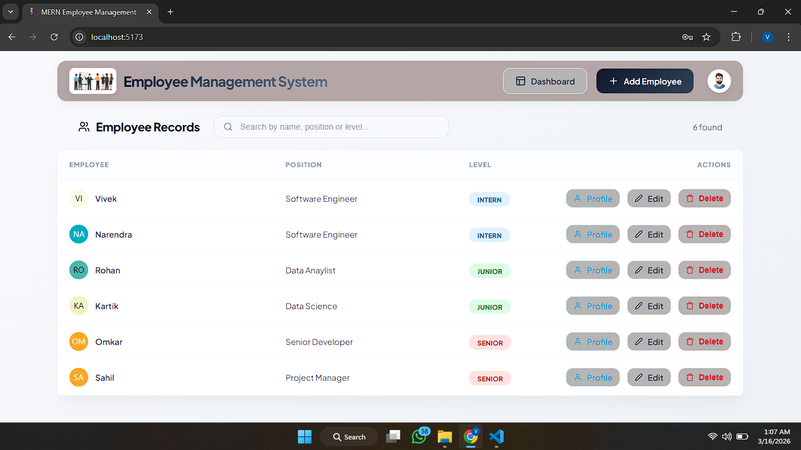
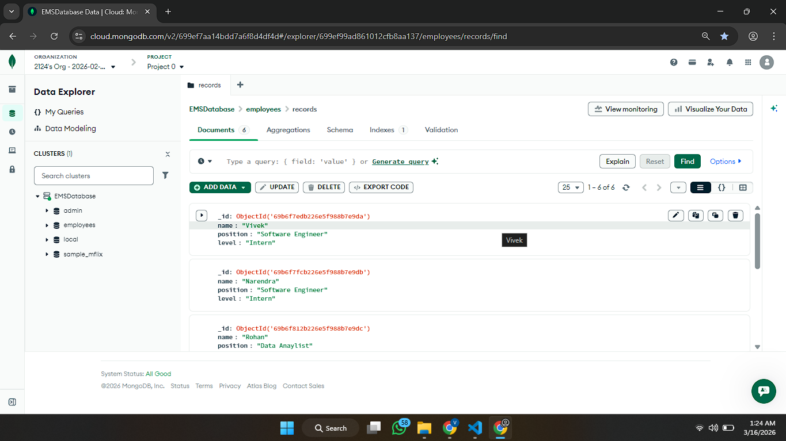

# Employee Management System (EMS)

A full-stack web application for managing employee records with authentication, built using React, A Full Stack Employee Management System built using the MERN Stack (MongoDB, Express, React, Node.js).
The application allows users to manage employee records efficiently with features like adding employees, viewing profiles, editing details, and deleting recordsNode.js, Express, and MongoDB. Modern employee dashboard with search, profile view, edit, and delete functionality.

## Features

- User authentication (login/logout)
- View employee records
- Add new employees
- Edit existing employee information
- Delete employee records
- Responsive UI with Tailwind CSS

## Screenshots

---

## Author
Vivek Jagtap  
Aspiring Frontend / Full Stack Developer
